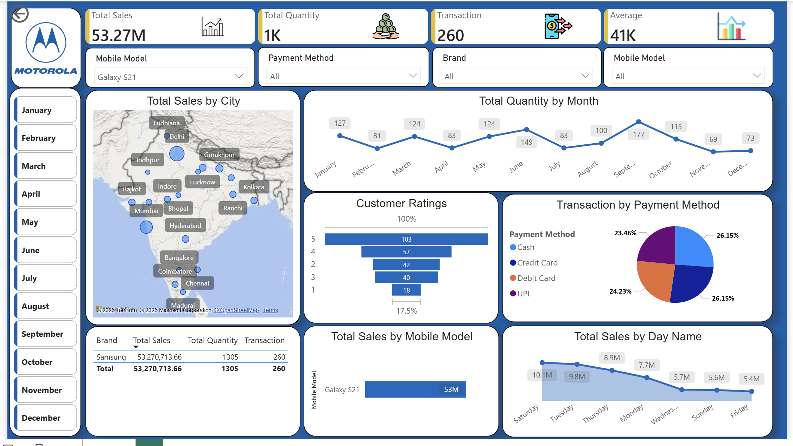

# 📱 Motorola Sales Performance Analytics Dashboard

## 📊 Project Overview
This project features an interactive and production-ready **Power BI Dashboard** built to evaluate and analyze retail sales performance for Motorola mobile devices. The dashboard effectively transforms raw transactional data into actionable executive insights, monitoring key business metrics like revenue distribution, seasonal trends, and consumer purchasing behavior.

---

## 🎯 Key Performance Indicators (KPIs)
Based on the dashboard analysis, the business achieved the following metrics:
* **Total Sales Revenue:** $53.27M
* **Total Quantity Sold:** 1K Units
* **Total Transactions:** 260
* **Average Order Value:** 41K

---

## 📸 Dashboard Preview

---

## 💡 Core Insights & Features

### 1. Spatial Analytics (Total Sales by City)
* Integrated a geographical map visual to track revenue spread across key Indian urban hubs including Delhi, Lucknow, Mumbai, Bhopal, Hyderabad, Bangalore, and Chennai.
* This helps identify high-performing territories and regional demand variations.

### 2. Temporal & Trend Analysis
* **Total Quantity by Month:** A continuous line chart capturing monthly volume fluctuations (ranging from peak periods with 177 units in September down to seasonal lows).
* **Total Sales by Day Name:** A trend analysis showcasing weekly sales distribution, revealing peak revenue days (such as Saturday generating $10.1M and Tuesday at $9.8M).

### 3. Consumer Behavior & Logistics
* **Transaction by Payment Method:** A clear breakdown of customer payment preferences, showing a healthy mix between Credit Cards (26.15%), UPI (26.15%), Cash (23.46%), and Debit Cards (24.23%).
* **Customer Ratings:** A funnel distribution tracking product satisfaction metrics from score 1 to 5, helping evaluate consumer sentiment.
* **Product Insights:** Dedicated breakdown focusing on top-performing stock keeping units (SKUs) like the *Galaxy S21* ($53M).

---

## 🛠️ Data Toolkit & Methodology
* **Analytics Platform:** Power BI Desktop
* **Data Engineering:** Power Query for data ingestion, type casting, schema structuring, and localization.
* **UI/UX Design:** Implemented a clean dashboard design using content containers, high-contrast typography, structural grid symmetry, and a professional corporate blue theme.

---

## 📂 How to Explore this Project
1. Download the **`Motorola Sales Dashboard.pbix`** file from the repository file list above.
2. Open the file in **Power BI Desktop** to explore the underlying data model, relationships, and filter cross-highlighting.
